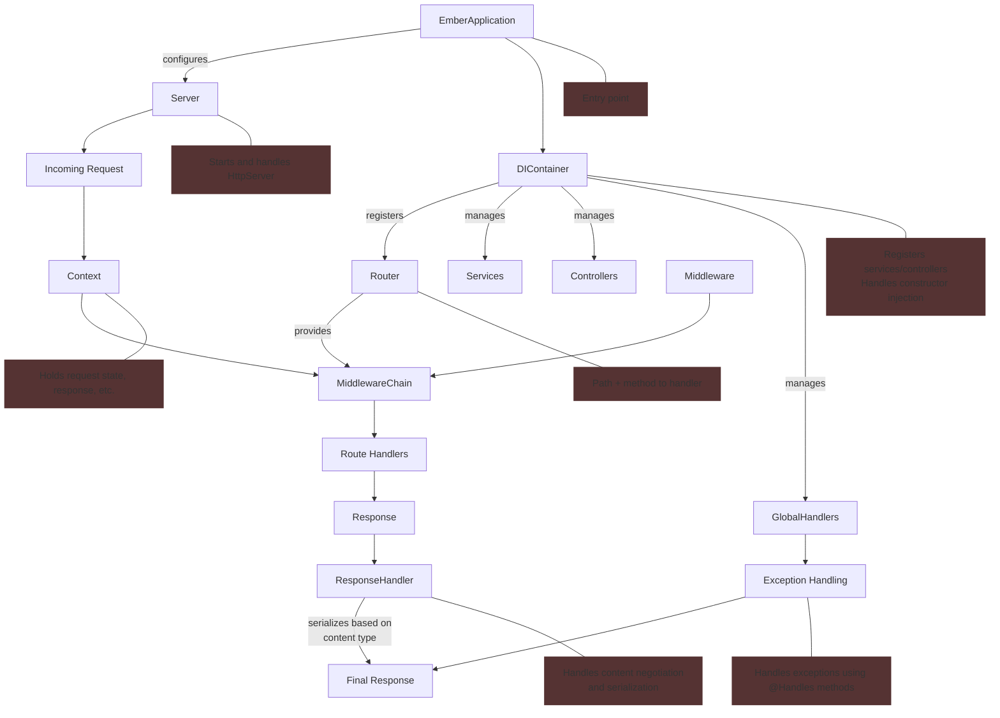

# Ember Framework

## Overview
Ember Framework is a lightweight Java web framework designed for building RESTful APIs with simplicity and flexibility. It provides features like dependency injection, middleware support, request validation, and annotation-based development to streamline the creation of modern web applications.

## Features
- **Routing**: Flexible routing with support for path and query parameters.
- **Dependency Injection**: Built-in DI container for managing services and controllers.
- **Middleware**: Global and route-specific middleware for request handling.
- **Annotations**: Simplified development with custom annotations (`@Controller`, `@Service`, `@PathParameter`, etc.).

## Architecture




## Example

```java
import io.github.renatompf.ember.annotations.middleware.WithMiddleware;
import io.github.renatompf.ember.core.Context;
import io.github.renatompf.ember.core.Middleware;

// Declare middleware for authentication
public class AuthMiddleware implements Middleware {
    @Override
    public void handle(Context context) throws Exception {
        String token = context.headers().header("Authorization");
        if (token == null || !token.equals("valid-token")) {
            throw new HttpException(HttpStatusCode.UNAUTHORIZED, "Invalid or missing token");
        }
    }
}

// Declare middleware for logging
public class LoggingMiddleware implements Middleware {
    @Override
    public void handle(Context context) {
        System.out.println("Request received: " + context.getPath());
    }
}

// Controller using middleware
@Controller("/secure")
@WithMiddleware({AuthMiddleware.class}) // Applied to all methods in this controller
public class SecureController {

    @Get("/data")
    public Response getData() {
        return Response.ok().body("Secure data accessed successfully!").build();
    }

    @Get("/validate")
    @WithMiddleware(LoggingMiddleware.class)
    public Response validateAndGetData() {
        return Response.ok().body("Validation passed, secure data accessed!").build();
    }
}
```

Access the secure endpoint at `http://localhost:8080/secure/data` and `http://localhost:8080/secure/validate`  with a valid token in the header.

## Documentation

### Annotations
- `@Controller`: Marks a class as a controller.
- `@Service`: Marks a class as a service.
- `@Get`, `@Post`, `@Put`, ...: Maps HTTP methods to controller methods.
- `@PathParameter`: Binds a path parameter to a method argument.
- `@QueryParameter`: Binds a query parameter to a method argument.
- `@RequestBody`: Binds the request body to a method argument.
- `@WithMiddleware`: Applies middleware to a controller or method.
- `@GlobalHandler`: Marks class as a global exception handler.
- `@Handles`: Marks a method to handle a specific exception.
- `@Consumes`: Specifies the content type that a method can consume.
- `@Produces`: Specifies the content type that a method can produce.
- `@Validated`: Marks an object for validation using [Jakarta Validation](https://beanvalidation.org/).

### Middleware
Use `@WithMiddleware` to apply middleware globally or to specific routes.

## Contributing
Contributions are welcome! Please follow these steps:
1. Fork the repository.
2. Create a new branch for your feature or bug fix.
3. Submit a pull request with a detailed description of your changes.

## License
This project is licensed under the [MIT License](LICENSE).
